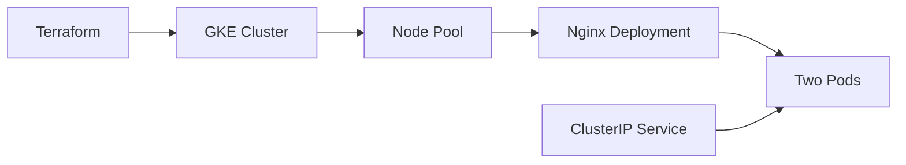
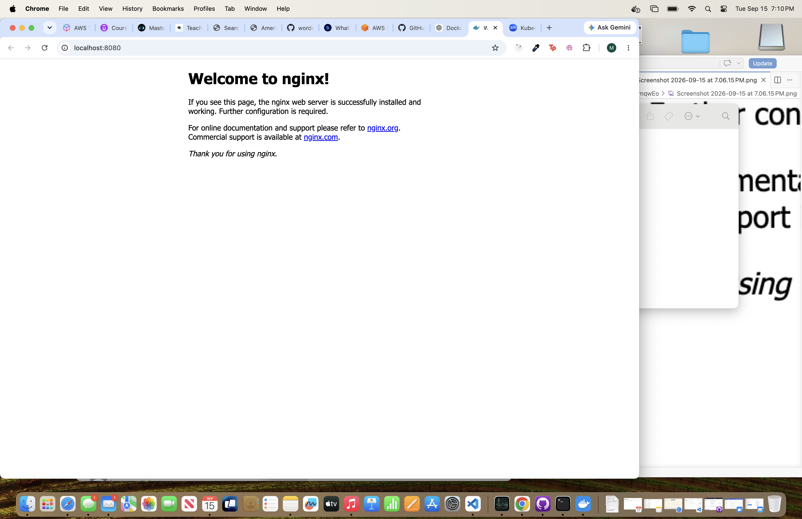

# Terraform GKE Cluster

A cloud infrastructure project that provisions a Google Kubernetes Engine (GKE) cluster using Terraform and deploys an Nginx application to Kubernetes.

## Architecture



## Technologies

- Terraform
- Google Cloud Platform
- Google Kubernetes Engine
- Kubernetes
- kubectl
- Nginx

## What This Project Creates

- Compute Engine and Kubernetes Engine APIs
- Custom VPC network
- Custom subnet
- Zonal GKE cluster
- One-node GKE node pool
- Nginx Deployment with two replicas
- ClusterIP Service

## Project Structure

```text
terraform-gke-cluster/
├── kubernetes/
│   ├── nginx.yaml
│   └── screenshots/
│       └── nginx-running.png
├── .gitignore
├── main.tf
├── outputs.tf
├── provider.tf
├── terraform.tfvars.example
├── variables.tf
└── versions.tf
```

## Prerequisites

- Google Cloud account with billing enabled
- Google Cloud CLI
- Terraform
- kubectl

## Authentication

```bash
gcloud auth login
gcloud auth application-default login
```

## Configuration

Copy the example variables file:

```bash
cp terraform.tfvars.example terraform.tfvars
```

Update `terraform.tfvars` with your Google Cloud project ID:

```hcl
project_id   = "your-google-cloud-project-id"
region       = "us-east1"
zone         = "us-east1-b"
cluster_name = "moyo-gke-cluster"
```

## Deploy the Infrastructure

```bash
terraform init
terraform fmt
terraform validate
terraform plan
terraform apply
```

Review the plan and type `yes` when prompted.

## Connect kubectl

Display the generated connection command:

```bash
terraform output -raw connect_command
```

Run the command shown by Terraform, then verify the node:

```bash
kubectl get nodes
```

## Deploy Nginx

```bash
kubectl apply -f kubernetes/nginx.yaml
kubectl get deployments,pods,services
```

## Access the Application

```bash
kubectl port-forward service/nginx-service 8080:80
```

Open `http://localhost:8080`.

## Screenshot



## Clean Up

To prevent continued cloud charges:

```bash
terraform destroy
```

Review the resources and type `yes` when prompted.

## Skills Demonstrated

- Infrastructure as Code
- Terraform providers, variables, outputs, and state
- GCP networking
- GKE cluster provisioning
- Kubernetes Deployments and Services
- Resource requests and limits
- Cloud authentication
- Infrastructure validation and cleanup

## Cost Warning

This project creates billable Google Cloud resources. Always run `terraform destroy` after testing.